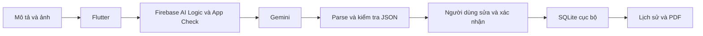

# Hồ sơ nộp AI Field Assistant

Ngày chuẩn bị: 01/10/2026. Bản ứng viên: **0.2.0+2**. Hồ sơ này là bản nháp để chủ dự án review, chưa xác nhận đã nộp hoặc đã phát hành. Hai request AI thật trên APK đã trả draft trên một máy; giới hạn và các gate khác xem ở SUBMISSION_STATUS.md.

## Nội dung biểu mẫu

**Tên sản phẩm:** AI Field Assistant

**Người dùng và vấn đề:** Nhân viên bảo trì tòa nhà cần ghi nhận sự cố điện, nước, điều hòa và thiết bị ngay tại hiện trường. Biểu mẫu dài làm gián đoạn công việc; báo cáo dễ thiếu bối cảnh, ảnh và cách ghi thống nhất.

**Giải pháp:** Ứng dụng Android cho phép nhập mô tả và chọn/chụp ảnh, gửi yêu cầu tạo bản nháp có cấu trúc, sau đó xem lại, sửa, xác nhận và lưu cục bộ. Người dùng mở lại báo cáo trong lịch sử và xuất PDF từ báo cáo đã xác nhận. AI chỉ đề xuất nội dung và hành động; người dùng quyết định nội dung được lưu.

**Mô tả quy trình (đáp ứng yêu cầu ít nhất 30 ký tự):** Tôi dùng Codex để khảo sát, triển khai và kiểm tra ứng dụng Flutter. Firebase AI Logic chuyển mô tả và ảnh thành bản nháp JSON; ứng dụng kiểm tra schema, đánh dấu thông tin thiếu, cho người dùng xem lại và xác nhận trước khi lưu SQLite. Tôi kiểm thử logic, lỗi dịch vụ, lưu/đọc báo cáo và ghi riêng bằng chứng Android, APK, AI thật và giới hạn chưa kiểm chứng trong worklog.

**Công cụ AI đã dùng:** Codex hỗ trợ lập kế hoạch, code, kiểm thử và tài liệu. Ứng dụng gọi Gemini qua Firebase AI Logic; model chính gemini-3.8-flash, fallback gemini-3.5-flash-lite chỉ khi lỗi được ánh xạ thành quota. Model/quota theo project và thời điểm.

**Prompt đã dùng trong sản phẩm:** Prompt thực tế ở `lib/services/report_draft_prompt.dart`. Có thể dán phần sau vào Prompts used; mô tả/ảnh người dùng là nội dung gửi riêng, không phải dữ liệu mẫu nhúng sẵn:

> Bạn là trợ lý lập bản nháp báo cáo sự cố cho nhân viên bảo trì tòa nhà. Phân tích mô tả và ảnh được gửi kèm để tạo bản nháp ngắn bằng tiếng Việt. Chỉ dùng dữ kiện được nêu rõ hoặc nhìn thấy rõ; không suy đoán địa điểm, nguyên nhân, mức độ hư hỏng hay công việc đã thực hiện. Trường thiếu căn cứ được để rỗng; priority chỉ low, medium, high hoặc null. suggested_action là hành động đề xuất. summary chỉ tóm tắt dữ kiện người dùng đã nêu rõ. Đưa các trường thiếu hoặc không chắc chắn vào needs_confirmation. Trả đúng một JSON object gồm category, location, priority, issue, suggested_action, summary, needs_confirmation; không thêm Markdown hoặc lời dẫn.

Đoạn trên là bản rút gọn trung thực từ prompt đang dùng; nếu biểu mẫu yêu cầu nguyên văn, copy nguyên hằng reportDraftPrompt từ source. Không dán ảnh/response hiện trường hoặc token vào biểu mẫu.

**Ví dụ Codex được giao việc:** “Cấu hình App Check cho Android release bằng reCAPTCHA, giữ Debug provider cho debug, không fallback debug khi lỗi; kiểm tra format/analyze/test liên quan và cập nhật docs, giữ nguyên các thay đổi có trước.” Đây là diễn giải phạm vi đã thực hiện, không phải trích nguyên văn toàn bộ cuộc trò chuyện.

**Ví dụ AI hỗ trợ phát triển sai và được kiểm chứng:** Code bootstrap ban đầu dùng callback setState trả Future. Widget test retry phát hiện lỗi; callback được đổi sang void và bộ App Check/bootstrap/service/parser chạy lại đạt 52/52 trong lượt Task 2. Không bịa ví dụ Gemini nhận định sai nếu chưa quan sát đầu ra thật của bản release.

**Số giờ tiết kiệm nhờ AI:** Chưa có số đo hoặc ước lượng của chủ dự án. Để chủ dự án điền, không tự đặt con số. Có thể ước lượng từng công việc từ thời gian cách làm thông thường trừ thời gian dùng AI, kể cả thời gian kiểm chứng/sửa sai.

**Showcase và chia sẻ nhật ký prompt:** Chủ dự án đã trả lời “cho phép full” cho cả hai lựa chọn: cho phép showcase sản phẩm công khai và chia sẻ nhật ký prompt. Chỉ chia sẻ prompt/worklog đã rà dữ liệu; không công khai token, private signing, raw logs hoặc báo cáo cá nhân. Câu trả lời này không cung cấp số giờ tiết kiệm, mục số giờ vẫn cần chủ dự án điền.

**Tệp/link sản phẩm:** APK qua GitHub Release, video qua Google Drive theo lựa chọn người dùng. Link cuối và quyền truy cập chỉ được điền sau publication và kiểm tra bằng người nhận chưa đăng nhập; chưa có link APK/video công khai trong hồ sơ này.

## Kiến trúc và quyết định kỹ thuật

Chọn Flutter Android-first để có bản demo cài được. Tách model/parser, service AI và repository; dùng SQLite cho dữ liệu có cấu trúc. Firebase quản lý proxy AI; APK không giữ Gemini Developer API secret. App Check Android release dùng reCAPTCHA để xác minh tự động; người nhận không phải đăng ký debug token. Site key là cấu hình client công khai, không phải nơi bảo vệ bí mật. Chưa suy host tests/build thành bằng chứng token/AI trên mọi máy.

## Giới hạn cần giữ trong bài nộp

- Cần Internet và quota còn để gọi AI; lưu/lịch sử cục bộ không có nghĩa là AI offline.
- Không có đăng nhập, đồng bộ cloud, dashboard, voice hoặc GPS.
- AI có thể thiếu dữ kiện; không lưu bản nháp như nội dung đã xác nhận.
- reCAPTCHA Android còn Preview; người nhận cần môi trường được provider chấp nhận. Không cam kết mọi máy chỉ cần có APK đều PASS.
- Native text-only và AI kèm ảnh tổng hợp vừa PASS trên PKG110 Android 16/API 36 ở hai request riêng; điều này không chứng minh ổn định trên mọi máy. PDF lưu/review và text report qua restart cũng PASS riêng. PDF demo cụ thể có ký tự gõ thừa trong summary, nên không phát hành PDF đó làm sản phẩm mẫu. Share sheet chỉ được mở rồi hủy; ảnh sau restart, offline, camera/từ chối quyền còn NOT RUN.
- GitHub source/release URL có metadata tài khoản; tệp nộp đã dùng thương hiệu sản phẩm thay tên/logo cá nhân. Không viết lại lịch sử Git hoặc tạo repo ẩn danh mới trong lượt chuẩn bị này.

## Nếu có thêm 7 ngày

Kiểm chứng attestation và quota trên nhiều máy; kiểm tra ảnh sau restart/offline/PDF; cải thiện thông báo cấu hình và quan sát lỗi có giới hạn dữ liệu; nâng native SDK theo lịch deprecation; đo thời gian ghi nhận và chỉnh sửa báo cáo với nhân viên bảo trì để đánh giá giá trị thực tế trước khi mở rộng tính năng.
